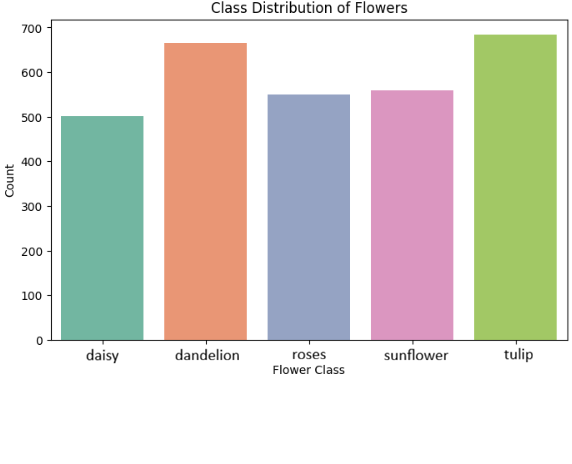
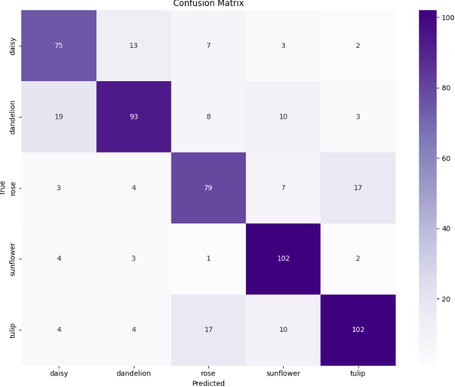

# Flowers Classification
This project presents the limitations of traditional ML approaches in classifying RGB images.

The dataset used can be found here: [Flower Dataset](https://www.kaggle.com/datasets/denisacernatoiu/custopn-flowers)

## Flowers distribution

In their raw format, classifying these images is computationally inefficient and leads to poor accuracy (~0.55), as each image has 128×128×3 features.

## Preprocessing:
- resizing all images to 128x128;
- converting them to RGB;
- feature engineering: extracting features such as histograms and descriptors (LBP, ORB, SIFT, HOG);
- standardization.

## Classification
After preprocessing, a gird search is used for searching the best combination between the numbers of components needed and the SVM C parameter.

## Results
After testing the accuracy is 0.76 for 500 components and C = 10, but a similar result can also be performed at 200 components and C = 10.

Most misclassifications occur between dandelion ↔ daisy and rose ↔ tulip, with additional confusion between sunflower and dandelion or tulip.
